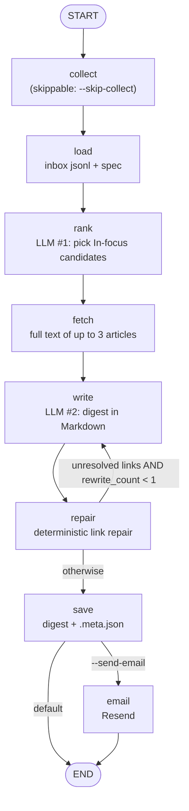

# osint-digest-langgraph

A periodic digest of **public Russian-language news sources** (independent media, investigative outlets, public Telegram channels), written in English by an LLM, built as an explicit **LangGraph** state machine with optional **Langfuse** tracing.

Collection uses public RSS feeds and public Telegram web previews (35 enabled sources, see [`docs/sources.md`](docs/sources.md)); the pipeline also fetches the full text of up to 3 linked articles (any host). Output is a Markdown digest (and, only if you ask for it, an HTML e-mail via Resend). The digest is a reading aid: summaries are condensed from the outlets' own reporting and are not independently verified.

## Architecture



| Node | What it does | Retry |
|---|---|---|
| `collect` | runs `python -m collector.monitor --since 4`: fetch RSS/Telegram, theme-tag, dedup by URL, write `inbox/run-*.jsonl` | no |
| `load` | reads the inbox (or `--inbox-file`) and `prompts/digest_spec.md` | no |
| `rank` | LLM call #1, JSON list of candidate item numbers for the "In focus" section | 4 attempts, transient errors only |
| `fetch` | trafilatura full-text extraction for the top 3 fetchable candidates (Telegram links skipped) | 4 attempts |
| `write` | LLM call #2, the digest; section spec comes verbatim from `prompts/digest_spec.md` | 4 attempts |
| `repair` | every URL in the draft that was not in the input is swapped for the closest collected URL (difflib, cutoff 0.9) or unwrapped to plain text | no |
| `save` | writes `<DATA_DIR>/digests/<day>_RU-OSINT-digest.md` and a `.meta.json` sidecar (counts, token usage, repaired/removed links) | no |
| `email` | Resend, only with `--send-email` | 4 attempts |

## Why LangGraph

- **Retry policy per node.** A single connect timeout to the LLM endpoint killed a whole run before the pipeline was a graph. Network-bound nodes now carry a `RetryPolicy(max_attempts=4, initial_interval=5.0)` (LLM read timeout 300 s) that retries only transient errors (URLError, timeouts, HTTP 408/429/5xx); everything else fails fast. Measured end-to-end on 2026-10-02 on a slow connection: the rank call timed out three times and succeeded on the fourth attempt; the run completed in 943 s (normal: 41–123 s).
- **Bounded rewrite loop.** The model sometimes invents or corrupts URLs. `repair` fixes what it can deterministically; if links still cannot be resolved, one (and only one, `MAX_REWRITES = 1`) rewrite pass goes back to `write` with the offending URLs listed. The bound lives in a pure routing function that is unit-tested.
- **Explicit state.** Everything that crosses a step (`picks`, `focus`, `draft`, `unresolved`, `rewrite_count`, `write_calls`) is a typed `State` key. The same state feeds the `.meta.json` sidecar and the Langfuse root-span metadata, so a run can be audited without rereading prompts.
- **Opt-in side effects.** E-mail is a separate node behind a conditional edge that is taken only with `--send-email`.

## Langfuse tracing design

Tracing is active only when `LANGFUSE_PUBLIC_KEY` and `LANGFUSE_SECRET_KEY` are set; otherwise `observe` is a no-op and nothing is imported from Langfuse.

- One **root span per run** (`osint-digest-run`); every node is a child span; every LLM call is a `generation` with `usage_details` (input/output tokens) and model name.
- **Metadata-only spans.** All decorators use `capture_input=False, capture_output=False`. Spans are configured not to capture inputs or outputs; they carry counts and sizes (`system_chars`, `user_chars`, item count, rewrite count, token usage).
- **Why.** The first version captured full inputs and outputs. A run's prompts are roughly 150k tokens of article lists, and the export of those spans timed out. Metadata-only spans export reliably and still answer the operational questions (latency, tokens, retries, rewrites). If you need the text, it is in the saved digest and the inbox file.
- Uses the Langfuse Python SDK `@observe` decorator, not the LangChain callback handler: the LLM calls here are plain `urllib`, not LangChain.

## Setup

Python 3.13 was used; 3.11+ should work.

```bash
python -m venv .venv
. .venv/bin/activate            # Windows: .venv\Scripts\activate
pip install -r requirements.txt     # requirements-dev.txt adds pytest
cp .env.example .env            # fill in the names you need; never commit it
```

Variables (names only in `.env.example`):

| Variable | Purpose |
|---|---|
| `LLM_API_KEY_VAR` | name of the variable that holds the LLM key (default `OPENROUTER_API_KEY`) |
| `OPENROUTER_API_KEY` | the key itself (or whichever variable `LLM_API_KEY_VAR` names) |
| `LLM_BASE_URL` | OpenAI-compatible base URL (default `https://openrouter.ai/api/v1`) |
| `DEEPSEEK_MODEL` | model id (default `deepseek/deepseek-v4.1-flash`) |
| `RESEND_API_KEY`, `DIGEST_TO`, `RESEND_FROM` | e-mail, used only with `--send-email` |
| `LANGFUSE_PUBLIC_KEY`, `LANGFUSE_SECRET_KEY`, `LANGFUSE_HOST` | tracing, optional |
| `DATA_DIR` | working data: `inbox/`, `digests/`, `seen_urls.json`, `monitor.log` (default `./data`) |
| `DIGEST_TZ` | optional time zone for the digest date (default UTC) |

The process environment always wins. Instead of exporting variables you can pass `--env-file PATH` (KEY=VALUE lines, empty values ignored). The `--env-file` is read before the tracing decorators are applied, so it can carry the `LANGFUSE_*` keys.

## Run

```bash
# full run: collect, rank, fetch, write, repair, save (no e-mail)
python -m digest.graph

# re-run on an existing inbox file, no network collection
python -m digest.graph --skip-collect --inbox-file data/inbox/run-YYYYMMDD-HHMM.jsonl

# send the e-mail as well (explicit opt-in)
python -m digest.graph --send-email --env-file .env

# collector only
python -m collector.monitor --dry-run
python -m collector.monitor --since 7 --source proekt

# tests (offline)
python -m pytest
```

Scheduling: [`deploy/systemd/`](deploy/systemd) has a oneshot service and a timer with a placeholder schedule (daily 07:00 UTC), user and paths.

## Cost per run

Measured on 2026-10-02 with `deepseek/deepseek-v4.1-flash` via OpenRouter, 404 collected items: about **155k prompt tokens and 13k completion tokens** per run (two LLM calls when the rewrite loop does not fire), **41 to 123 s** wall time. One data point, one model, one day; token counts scale with the number of items collected. The exact figures per run are in the `.meta.json` sidecar (`llm_calls`).

## Limitations

- **The rewrite loop rarely fires.** Deterministic link repair resolves nearly every bad URL first, so the second `write` pass is a safety net that has seen little use. Its bound is tested; its quality benefit is not well measured.
- **Transliteration errors are not caught mechanically.** Names of people and organisations are transliterated from Cyrillic by the model; inconsistent or wrong spellings pass through. Link repair checks URLs, not prose.
- **Claims are not fact-checked.** Item summaries come from outlets' own reporting (some are single-source breaking channels); the model can still misstate details of the full-text pieces. Treat the digest as a lead list, verify before quoting.
- **The inbox is not archived by the graph.** `save` never moves inbox files, so on a schedule you need to rotate `DATA_DIR/inbox/` yourself or each run will include earlier files.
- **Telegram previews and some RSS feeds are fragile** (Cloudflare 403, changed endpoints); the Telegram fallback covers part of this. Source status is dated 2026-06-23.
- The default beat in `prompts/digest_spec.md` and `priority_keywords` in `config/sources.json` reflect one use case; edit both to retarget. `priority_keywords` ships empty: it is a user-supplied list of lowercase substrings (for example `["sanctions", "energy"]`) that flags matching items as priority.

## Layout

```
digest/        pipeline.py (steps as plain functions), graph.py (StateGraph, tracing, CLI)
collector/     monitor.py (tagging, dedup, inbox), fetcher.py (RSS/Atom, Telegram preview)
config/        sources.json (sources, theme dictionaries, priority keywords)
prompts/       digest_spec.md (the product spec sent to the model)
deploy/        systemd unit and timer
docs/          sources.md
tests/         offline tests
```

## License

Apache-2.0, see [`LICENSE`](LICENSE).
