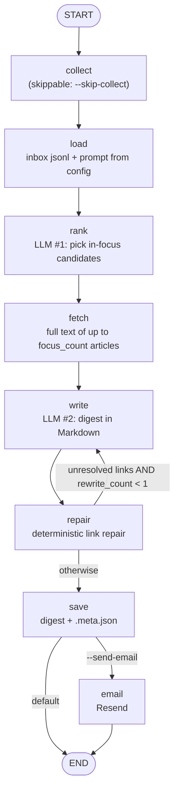

# langgraph-digest
[](https://github.com/csakegyruszki/langgraph-digest/actions/workflows/tests.yml)

A config-driven news digest pipeline, built as an explicit LangGraph state machine with optional Langfuse tracing.

One JSON file defines a digest: title, output language, audience, sections, priority keywords and
sources. The pipeline collects public RSS/Atom feeds and public Telegram web previews, has an LLM
pick the most significant stories, fetches their full text, writes the digest in Markdown,
repairs links the model invented or corrupted, and saves the result with a metadata sidecar. An
HTML e-mail via Resend is sent on explicit opt-in.

## What sets it apart

- **One file per digest.** Everything topic-specific (sections, audience, language, keywords,
  themes, sources) lives in `digest.json`; the prompt template in
  [`prompts/digest_template.md`](prompts/digest_template.md) is generic. A new digest is a new
  config, not new code (`digest/pipeline.py` config loading; two shipped examples).
- **Collection to delivery as an explicit graph.** `collect → load → rank → fetch → write →
  repair → save → (email)` is a LangGraph `StateGraph` with typed state; the topology is
  unit-tested (`digest/graph.py` `build_graph`, `tests/test_graph.py`).
- **Per-node retry policy.** `rank`, `fetch` and `write` retry up to 4 times on transient errors
  only (URL errors, timeouts, HTTP 408/429/5xx); every other node, including e-mail, runs once
  (`digest/graph.py` `_transient`, `RetryPolicy`).
- **Deterministic link repair with a bounded rewrite loop.** Every Markdown link not present in the
  input is swapped for the closest collected URL (difflib, cutoff 0.9) or unwrapped; if links
  remain unresolved, exactly one rewrite pass returns to `write` (`MAX_REWRITES = 1`,
  `route_after_repair`, tested).
- **Tracing without prompt text.** Langfuse spans are created with `capture_input=False,
  capture_output=False`: one root span per run, one span per node, one generation per LLM call with
  token usage and model name, and no prompt or response text.

## Quick start

Python 3.11+ (developed on 3.13).

```bash
python -m venv .venv
. .venv/bin/activate                  # Windows: .venv\Scripts\activate
pip install -r requirements.txt
pip install -r requirements-dev.txt   # pytest
cp .env.example .env                  # fill in the names you need; never commit it

python -m collector.monitor --dry-run # check the sources, writes nothing
python -m digest.graph --env-file .env
```

The default config is [`examples/tech-news/digest.json`](examples/tech-news/digest.json) and needs
no edits. A real run needs a key for an OpenAI-compatible LLM endpoint (`OPENROUTER_API_KEY`, or
the variable named by `LLM_API_KEY_VAR`). To make your own digest, copy an example folder and edit
`digest.json`.

More invocations:

```bash
python -m digest.graph --config examples/ru-media-watch/digest.json
python -m digest.graph --skip-collect --inbox-file data/inbox/run-YYYYMMDD-HHMM.jsonl
python -m digest.graph --send-email --env-file .env
python -m collector.monitor --since 7 --source hackernews
```

Scheduling: [`deploy/systemd/`](deploy/systemd) has a oneshot service and a timer with a
placeholder schedule (daily 07:00 UTC), user and paths.

## Examples

| Example | What it shows |
|---|---|
| [`examples/tech-news`](examples/tech-news) | Default. 4 public tech feeds, 3 sections, a few priority keywords; the smallest complete config. |
| [`examples/ru-media-watch`](examples/ru-media-watch) | 35 enabled public RSS/Telegram sources, 4 sections, theme dictionaries, an empty keyword list. Source notes in [`sources.md`](examples/ru-media-watch/sources.md). |

## How it works



| Node | What it does | Retry |
|---|---|---|
| `collect` | runs `python -m collector.monitor --config <config> --since <lookback_days>`: fetch RSS/Telegram, theme-tag, dedup by URL, write `inbox/run-*.jsonl` | no |
| `load` | reads the inbox (or `--inbox-file`) and builds the prompt from the template and the config | no |
| `rank` | LLM call #1, JSON list of candidate items for the in-focus section (skipped when `focus_count` is 0) | 4 attempts, transient errors |
| `fetch` | trafilatura full-text extraction for the top `focus_count` fetchable candidates (Telegram links skipped); a single article that fails is logged and the next candidate is tried | 4 attempts, transient errors |
| `write` | LLM call #2, the digest; the section spec is the config's `sections` rendered into the template | 4 attempts, transient errors |
| `repair` | swaps every link URL not in the input for the closest collected URL (difflib, cutoff 0.9) or unwraps it to plain text | no |
| `save` | writes `<DATA_DIR>/digests/<day>_<slug>.md` and a `.meta.json` sidecar (counts, token usage, repaired/removed links, config path) | no |
| `email` | Resend, only with `--send-email` | no (a retry after an accepted send would duplicate the e-mail) |

Everything that crosses a step (`cfg`, `picks`, `focus`, `draft`, `unresolved`, `rewrite_count`,
`write_calls`) is a typed `State` key. The same state feeds the `.meta.json` sidecar and the
Langfuse root-span metadata. The LLM read timeout is 300 s; provider error bodies go to the local
log, and exceptions carry the status code.

**Tracing.** Active when `LANGFUSE_PUBLIC_KEY` and `LANGFUSE_SECRET_KEY` are set; otherwise
`observe` is a no-op and nothing is imported from Langfuse. Spans carry counts and sizes
(`system_chars`, `user_chars`, item count, rewrite count, token usage). Metadata-only spans keep
exports small: a run's prompts can reach about 150k tokens of article lists. The full text is in
the saved digest and the inbox file. The integration uses the Langfuse Python SDK `@observe`
decorator, since the LLM calls are plain `urllib`, not LangChain.

## Configuration

Select a config with `--config PATH` or `DIGEST_CONFIG` (default
`examples/tech-news/digest.json`). Top-level blocks: `digest` (what to write), `settings`
(collector behaviour), `themes` (keyword dictionaries for tagging), `sources` (feeds).

### `digest`

| Key | Required | Meaning |
|---|---|---|
| `title` | yes | Digest name; used in the prompt and the e-mail subject |
| `slug` | yes | Output filename stem: `<day>_<slug>.md` (lowercased, non-alphanumerics become `-`) |
| `language` | no (English) | Language the digest is written in |
| `audience` | no | Who reads it and what they want; drives tone and level of explanation |
| `beat` | no | Topic scope in a few sentences; used by both LLM calls |
| `focus_count` | no (3) | Number of "in focus" items whose full text is fetched; `0` disables rank and fetch |
| `priority_keywords` | no (empty) | Lowercase substrings; an item whose title or lead contains one is flagged `PRIORITY` |
| `sections` | yes | Ordered list of `{name, instruction}`; exactly one has `"focus": true` when `focus_count > 0` |

### `settings` (all optional)

| Key | Default | Meaning |
|---|---|---|
| `lookback_days` | 4 | Items older than this are dropped |
| `max_items_per_source` | 25 | Per-source cap per run |
| `request_timeout` | 20 | Seconds per HTTP request |
| `accept_language` | `en-US,en;q=0.9` | `Accept-Language` header for fetches |
| `theme_filter_sources` | `[]` | Source ids that keep only items matching a theme or keyword |
| `inbox_dir`, `archive_dir`, `digests_dir`, `seen_path`, `log_path` | see examples | State paths, relative to `DATA_DIR` |

### `themes`

An object `{theme_name: [lowercase substrings]}`. An item gets a tag for every theme with a
substring in its title or lead; two or more tags, or a priority keyword, set the `PRIORITY` flag.
Section instructions can refer to tags in backticks (for example "every item tagged `security`").

### Sources

```json
{"id": "lwn", "name": "LWN.net", "lang": "en", "method": "rss",
 "urls": ["https://lwn.net/headlines/rss"], "enabled": true, "tier": "thematic"}
```

`method` is `rss` (RSS 2.0 or Atom; `urls` may list several; an optional `"telegram": "<channel>"`
is a fallback when the feed fails) or `telegram` (public web preview `t.me/s/<channel>`). Check a
new source with `python -m collector.monitor --dry-run --source <id>`.

### Sections

Each section is a name plus one instruction: what goes in it, how many items, how long each, and
what each entry must contain. Put the full-text section first and mark it `"focus": true`; give
concrete counts and lengths ("5-8 items, 2-3 sentences each"); reference theme names to make a
section depend on tagging.

### Environment

Names only in [`.env.example`](.env.example). The process environment wins over `--env-file`
values; empty values in the file are ignored. `--env-file` is read before the tracing decorators
are applied, so it can carry the `LANGFUSE_*` keys.

| Variable | Purpose |
|---|---|
| `LLM_API_KEY_VAR` | name of the variable that holds the LLM key (default `OPENROUTER_API_KEY`) |
| `OPENROUTER_API_KEY` | the key itself (or whichever variable `LLM_API_KEY_VAR` names) |
| `LLM_BASE_URL` | OpenAI-compatible base URL (default `https://openrouter.ai/api/v1`) |
| `DEEPSEEK_MODEL` | model id (default `deepseek/deepseek-v4.1-flash`) |
| `RESEND_API_KEY`, `DIGEST_TO`, `RESEND_FROM` | e-mail, used only with `--send-email` |
| `LANGFUSE_PUBLIC_KEY`, `LANGFUSE_SECRET_KEY`, `LANGFUSE_HOST` | tracing, optional |
| `DIGEST_CONFIG` | path to the digest config JSON |
| `DATA_DIR` | working data: `inbox/`, `digests/`, `seen_urls.json`, `monitor.log` (default `./data`) |
| `DIGEST_TZ` | time zone for the digest date (default UTC) |

## Cost per run

Measured on 2026-10-02 on the ru-media-watch example (35 sources, 404 collected items) with
`deepseek/deepseek-v4.1-flash` via OpenRouter: about 155k prompt tokens and 13k completion tokens
per run (two LLM calls when the rewrite loop does not fire), 41 to 123 s wall time. A single
measurement; token counts scale with the number of items collected. Exact figures per run are in
the `.meta.json` sidecar (`llm_calls`).

## Scope and limits

- **A reading aid, not a fact-check.** Summaries are condensed from the sources' own reporting and
  are not independently verified; the model can misstate details. Verify before quoting.
- **Link repair checks URLs, not prose.** Names transliterated from non-Latin sources are not
  checked mechanically.
- **Rewrite loop.** In observed runs deterministic repair resolved bad links before a rewrite was
  needed; the loop's bound is tested, its effect on output quality is not measured.
- **Inbox rotation is external.** `save` never moves inbox files; on a schedule, rotate
  `DATA_DIR/inbox/` yourself or each run includes earlier files.
- **Feed availability varies.** Telegram previews and some RSS feeds return Cloudflare 403s or
  change endpoints; the Telegram fallback covers part of this. Source status of ru-media-watch is
  dated 2026-06-23; the tech-news feeds were checked on 2026-10-03.
- **End-to-end coverage.** tech-news was run end to end on the current code with live collection
  and real LLM calls (2026-10-03: 70 items, all configured sections produced); ru-media-watch was
  run end to end on 2026-10-02, before its sections moved into `digest.json`.
- **Tagging is substring matching** on lowercased text; tune `themes` and `priority_keywords` per
  topic.
- Not affiliated with any of the outlets, providers or tools it can be pointed at.

## Tests

```bash
python -m pytest
```

16 offline tests (`tests/test_graph.py`): graph topology, the rewrite bound, e-mail opt-in, retry
policy placement and a node re-run on timeout, transient-error classification, config loading and
validation, prompt sections, tagging, link repair, `--env-file` precedence and state paths.

## Layout

```
digest/        pipeline.py (steps as plain functions, config loading), graph.py (StateGraph, tracing, CLI)
collector/     monitor.py (tagging, dedup, inbox), fetcher.py (RSS/Atom, Telegram preview)
prompts/       digest_template.md (generic prompt, filled from the config)
examples/      tech-news/ (default), ru-media-watch/
deploy/        systemd unit and timer
tests/         offline tests
```

## License

Apache-2.0, see [`LICENSE`](LICENSE).
